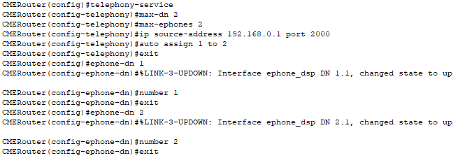

University: [ITMO University](https://itmo.ru/ru/)  
Faculty: [FICT](https://fict.itmo.ru)  
Course: [IP-telephony](https://github.com/itmo-ict-faculty/ip-telephony)  
Year: 2022/2023  
Group: 34202  
Author: Filianin Ivan Victorovich  
Lab: Lab1  
Date of create: 22.05.2022  
Date of finished: 28.05.2023  

Цель работы:
Изучить рабочую среду Cisco Packet Tracer, ознакомить- ся с интерфейсами основных устройств, типами кабелей, научиться собирать топологию. Изучить построение сети IP-телефонии с помощью маршрутизатора, коммутатора и IP телефонов Cisco 7960 в среде Packet tracer    
  
Ход работы:  
Часть 1:  
1) В Cisco Packet Tracer была построена указанная в работе модель сети (Рис. 1.).  
  
Рисунок 1 - Схема сети
2) Каждому из ПК блыи присвоены IP-адреса и маски подсети (Рис. 2.).
  
Рисунок 2 - Присовение IP-адреса
3) Были проведены пинги с компьютеров на компьютеры за другими коммутаторами (Рис. 3.).  
   
Рисунок 3 - Проведение пингов  
Часть 2:  
1) В Cisco Packet Tracer была построена указанная в работе модель сети (Рис. 4.).  
    
Рисунок 4 - Схема сети  
2) Было изменено название роутера (Рис. 5.).  
   
Рисунок 5 - Изменение названия  
3) Был задан IP-адрес на используемый интерфейс (Рис. 6.).  
   
Рисунок 6 - Присвоение адреса  
4) Был настроен DHCP сервер с названием "voice", сетью 192.168.0.0 и опцией 150, что позволяет телефонам загружать необходимую информацию с указанного сервера.  (Рис. 7.).  
  
Рисунок 7 - Настройка DHCP-сервера.  
5) Была настроена работа протокола - количество номеров и телефонов, адрес, на который будут приходить запросы информации, возможность автоприсваивания информации о номерах (Рис. 8.).   
 
Рисунок 8 - Настройка параметров протокола    
6) Нативный vlan был обозначен за vlan, передающий голосовой трафик (Рис. 9.). 
  
Рисунок 9 - Настройка коммутатора  
7) Работа телефонов была проверена, вызов проходит корректно (Рис. 10.).  
  
Рисунок 10 - Тестирование работы  
Вывод: Таким образом, была изучена рабочая среда Cisco Packet Tracer, проведено ознакомление с интерфейсами основных устройств, типами кабелей, получены навыки сборки топологии. Было изучено построение сети IP-телефонии с помощью маршрутизатора, коммутатора и IP телефонов Cisco 7960 в среде Packet tracer    
   
