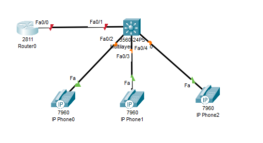
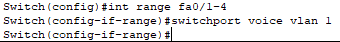

University: [ITMO University](https://itmo.ru/ru/)  
Faculty: [FICT](https://fict.itmo.ru)  
Course: [IP-telephony](https://github.com/itmo-ict-faculty/ip-telephony)  
Year: 2022/2023  
Group: 34202  
Author: Filianin Ivan Victorovich  
Lab: Lab2  
Date of create: 22.05.2022  
Date of finished: 28.05.2023  

Цель работы:
Изучить построение сети IP-телефонии с помощью маршрутизатора Cisco 2811, коммутатора Cisco catalyst 3560 и IP телефонов Cisco 7960.  
  
Ход работы:  
Часть 1:  
1) В Cisco Packet Tracer была построена указанная в работе модель сети (Рис. 1.).  
  
Рисунок 1 - Схема сети
2) Был отключен синтаксис ввода слов от DNS серверов, поставлен пароль при физическом подкючении/подключении через telnet или ssh (Рис. 2.).  
  
Рисунок 2 - Настройка роутера  
3) Был присвоен IP-адрес на необходимый интерфейс роутера, а так же настроен DHCP (Рис. 3.).  
   
Рисунок 3 - Настройка интерфейса и DHCP  
4) Были настроены параметры протокола (Рис. 4.).  
    
Рисунок 4 - Настройка параметров   
5) Были созданы записи номеров для присваивания (Рис. 5.).  
   
Рисунок 5 - Заполнение номеров  
6) Нативный vlan был обозначен как vlan, передающий голосовой трафик (Рис. 6.).  
   
Рисунок 6 - Настройка коммутатора  
7) Работа телефонов была проверена, вызов проходит корректно (Рис. 7.).  
  
Рисунок 7 - Тестирование работы  
Часть 2: 
0) Была построена необходимая модель сети (Рис. 8.).  
  
Рисунок 8 - Схема сети  
1) Были созданы необходимые vlan-ы, 2 из них отвечают за сеть ПК и сеть телефонов, а 1 - за передачу информации (Рис. 9.).  
  
Рисунок 9 - Создание vlan-ов  
2) Был настроен коммутатор - был присвоен адрес vlan-у, указан шлюз по умолчанию, а так же режим и vlan по умолчанию для интерфейса на роутер (Рис. 10.).   
  
Рисунок 10 - Настройка коммутатора   
3) Были настроены интерфейсы на ПК и телефоны - были указаны соответствующие vlan, передаваемый голосовой трафик одним из них и режим передачи данных vlan-ов (Рис. 11.).  
  
Рисунок 11 - Настройка интерфейсов  
4) Были настроены подинтерфейсы интерфейса роутера на коммутатор - указаны ip по необходимым vlan-ам, указан протокол инкапсуляции (Рис. 12.).  
  
Рисунок 12 - Настройка подинтерфейсов  
5) Были настроены DHCP-сервера, отдельный для телефонов и ПК. Были исключены уже использованные адреса vlan-ов для ПК и телефонов (Рис. 13.).  
  
Рисунок 13 - Настройка DHCP-сервера  
6) Были настроены параметры протокола (Рис. 14.).  
  
Рисунок 14 - Настройка параметров  
7) Были занесены данные о номерах (Рис. 15.).  
  
Рисунок 15 - Занесение номеров  
8) Работа телефонов была проверена, вызов проходит корректно (Рис. 16.).  
  
Рисунок 16 - Тестирование  
Вывод: Таким образом, было изучено построение сети IP-телефонии с помощью маршрутизатора Cisco 2811, коммутатора Cisco catalyst 3560 и IP телефонов Cisco 7960    
   
