University: [ITMO University](https://itmo.ru/ru/)  
Faculty: [FICT](https://fict.itmo.ru)  
Course: [IP-telephony](https://github.com/itmo-ict-faculty/ip-telephony)  
Year: 2022/2023  
Group: 34202  
Author: Filianin Ivan Victorovich  
Lab: Lab4  
Date of create: 22.05.2022  
Date of finished: 28.05.2023  

Цель работы:
Изучить построение сети IP-телефонии между удаленными филиалами с помощью маршрутизаторов Cisco 2811 и коммутаторов Cisco 2950Т.Изучить построение сети IP-телефонии между удаленными филиалами с помощью маршрутизаторов Cisco 2811 и Cisco 2600XM.
  
Ход работы:  
Часть 1:  
1) В Cisco Packet Tracer была построена указанная в работе модель сети. Дальнейшие действия выполнялись сразу на двух устройствах в разных подсетях и описаны только на примере устройств одной подсети (Рис. 1.).  
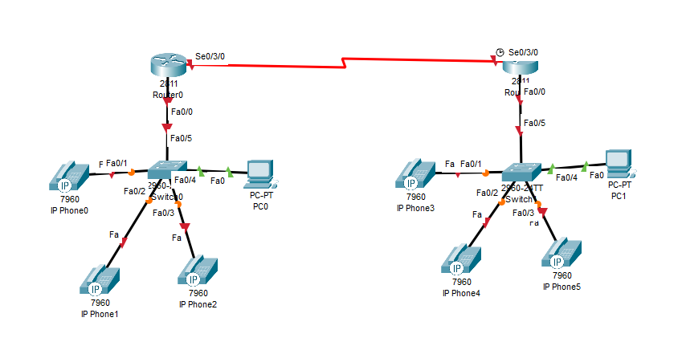  
Рисунок 1 - Схема сети  
2) Были созданы необходимые vlan (Рис. 2.).  
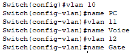  
Рисунок 2 - Создание vlan-ов
3) Был настроен коммутатор - был присвоен адрес vlan-у, указан шлюз по умолчанию, а так же режим и vlan по умолчанию для интерфейса на роутер (Рис. 3.).  
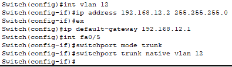  
Рисунок 3 - Настройка коммутаторов    
4) Были настроены vlan-ы на ПК и телефоны - были указаны соответствующие vlan, передаваемый голосовой трафик одним из них и режим передачи данных vlan-ов (Рис. 4.).  
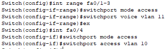  
Рисунок 4 - Настройка vlan-ов    
5) Были настроены подинтерфейсы интерфейса роутера на коммутатор - указаны ip по необходимым vlan-ам, указан протокол инкапсуляции (Рис. 5.).  
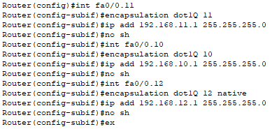  
Рисунок 5 - Настройка подинтерфейсов    
6) Были настроены DHCP-сервера, отдельный для телефонов и ПК. Были исключены уже использованные адреса vlan-ов для ПК и телефонов (Рис. 6.).  
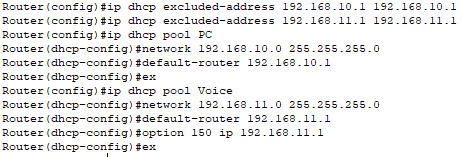  
Рисунок 6 - Настройка DHCP    
7) Были настроены параметры протокола (Рис. 7.).  
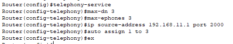  
Рисунок 7 - Настройка параметров протокола    
8) Были занесены данные о номерах (Рис. 8.).  
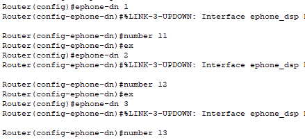  
Рисунок 8 - Занесение данных о номерах    
9) Были настроены Serial-порты маршрутизатора (Рис. 9.).  
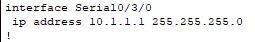  
Рисунок 9 - Настройка Serial-портов    
10) Был настроен протокол маршрутизации rip второй версии (Рис. 10.).  
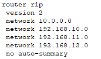  
Рисунок 10 - Настройка протокола rip    
11) Был настроен dial-peer на обоих роутерах, определяющий цель для передачи трафика на основе шаблона номера (Рис. 11.).  
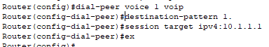  
Рисунок 11 - Настройка dial-peer    
12) Работа телефонов была проверена, вызов проходит корректно (Рис. 12.).    
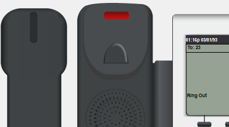  
Рисунок 12 - Тестирование    
13) Были выполнены команды ping, результат корректен (Рис. 13.).  
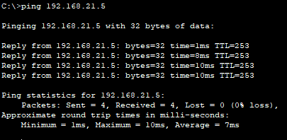  
Рисунок 13 - Тестирование ping-ом    
Вывод: Таким образом, было изучено построение сети IP-телефонии между удаленными филиалами с помощью маршрутизаторов Cisco 2811 и коммутаторов Cisco 2950Т, построение сети IP-телефонии между удаленными филиалами с помощью маршрутизаторов Cisco 2811 и Cisco 2600XM.
   
